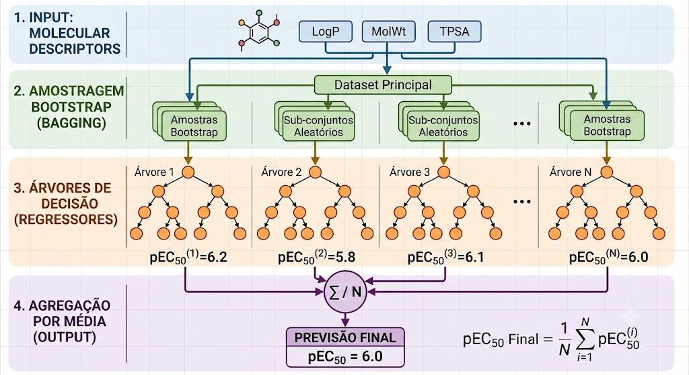

# Arquitetura — QSAR de Ecotoxicidade para Formulações Cosméticas Amazônicas

## Objetivo

Este projeto tem como objetivo prever a **ecotoxicidade** (inibição do crescimento de algas) de ativos amazônicos e, futuramente, de formulações cosméticas, utilizando modelos **QSAR (Quantitative Structure–Activity Relationship)** baseados em descritores moleculares.

O projeto integra o **TCC/PJC 2026 da Universidade Federal do Amapá (UNIFAP)** e foi desenvolvido integralmente em Python.

---

# Visão Geral

```text
                 Base Pública ECOTOX (EPA)
                           │
                           ▼
                 CAS → PubChem → SMILES
                           │
                           ▼
                  Descritores (RDKit)
                           │
                           ▼
              Treinamento do modelo QSAR
          Random Forest + Validação cruzada
                           │
                  Modelo congelado
                           │
         ┌─────────────────┴─────────────────┐
         ▼                                   ▼
 Validação externa                 Validação do modelo
 (ativos amazônicos)          (qualidade, Y-scrambling,
                                    leverage e GHS)
         │
         ▼
 Futuras formulações (Fase 3)
```

---

# Por que duas fases?

Os dados públicos e os dados experimentais respondem à mesma pergunta científica, porém em escalas diferentes.

- **Base pública:** uma molécula → um efeito biológico;
- **Base experimental:** um ingrediente → um efeito biológico.

Ainda não existe uma tabela contendo a composição completa das formulações cosméticas. Portanto, não é possível treinar diretamente um modelo para misturas.

A estratégia adotada segue a prática recomendada para modelos QSAR:

1. treinar utilizando uma base pública ampla;
2. congelar o modelo treinado;
3. validar externamente utilizando os dados experimentais.

Essa abordagem reduz o risco de **overfitting** em uma base pequena (6–17 amostras) e segue os princípios de validação da **OECD**.

---

# Fase 1 — Treinamento com Base Pública

## Objetivo

Construir um modelo QSAR utilizando dados públicos da **ECOTOX Knowledgebase (US EPA)**.

| Etapa | Ferramenta / Fonte |
|--------|--------------------|
| Dados de toxicidade | ECOTOX Knowledgebase |
| Conversão CAS → SMILES | PubChem PUG REST |
| Descritores | RDKit |
| Variável-resposta | pEC50 = −log10(EC50 em mol/L) |
| Modelo | Random Forest |
| Validação | Cross Validation (k = 5) |

### Funcionamento do Random Forest Regressor



O **Random Forest Regressor** é um algoritmo de aprendizado de máquina supervisionado baseado no princípio de métodos ensemble (*ensemble learning*), que constrói e combina previsões de múltiplas árvores de decisão. O processo de funcionamento do algoritmo é descrito pelas seguintes etapas:

1. **Amostragem com Reposição (Bootstrap):**
   * A partir da base filtrada do ECOTOX contendo $N$ amostras, o algoritmo gera subconjuntos de dados aleatórios e com reposição (*bootstrap samples*). Cada árvore de decisão individual é treinada em um desses subconjuntos. Isso significa que uma mesma amostra pode ser usada múltiplas vezes para treinar uma árvore, enquanto outras não são utilizadas nessa árvore específica.

2. **Construção de Árvores de Decisão Descorrelacionadas:**
   * Uma árvore de regressão tenta subdividir o espaço de dados em regiões homogêneas em relação à variável-resposta ($pEC50$).
   * **Subespaço Aleatório (Feature Randomness):** Em cada nó da árvore, em vez de avaliar todos os descritores moleculares para decidir onde dividir os dados, o algoritmo sorteia aleatoriamente um subconjunto dos descritores disponíveis. A árvore escolhe o melhor divisor somente a partir desse subconjunto sorteado, o que diminui a correlação entre as árvores criadas e aumenta a diversidade do modelo.

3. **Predição por Agregação (Bagging):**
   * Uma vez treinadas as árvores independentes (configuradas via `GridSearchCV`), o modelo final calcula a predição para um novo composto químico.
   * Cada árvore percorre seus nós de decisão até estimar um valor de $pEC50$ específico. A predição final do Random Forest é a **média aritmética simples** das estimativas de todas as árvores individuais:
     $$\hat{y} = \frac{1}{B} \sum_{b=1}^{B} f_b(x)$$
     onde $B$ é o número de árvores e $f_b(x)$ é a predição da árvore $b$. Este processo reduz significativamente a variância geral sem elevar o viés do modelo.

4. **Importância dos Descritores (Permutation Importance):**
   * Em vez de usar a importância nativa do RF (que pode ser enviesada), o algoritmo utiliza **Permutation Importance**. Ele embaralha os valores de um descritor específico e mede a queda na precisão (R²) do modelo. Se o R² despenca, aquele descritor era vital para a predição. Foi assim que o modelo identificou o peso molecular e a chave MACCS_139 (grupos hidroxila) como os fatores mais críticos para a toxicidade.

### Respaldo científico e posicionamento do projeto

**Ferro (2025)** — *Aprendizado de Máquina para predição de crescimento de Chlorella vulgaris* (UFAL, 2025) — comparou Random Forest, SVR e redes neurais para a mesma espécie biológica (*C. vulgaris*) e identificou o Random Forest como o algoritmo de melhor desempenho, com validação cruzada. Isso fornece respaldo nacional e recente para a escolha metodológica deste projeto.

A distinção entre as abordagens é fundamental:

| Aspecto | Ferro (UFAL, 2025) | Este projeto (PJC 2026) |
|---|---|---|
| **Objetivo** | Predizer crescimento/produção da alga | Predizer toxicidade de ingredientes sobre a alga |
| **Variáveis de entrada** | Nutrientes, intensidade luminosa, tempo | Descritores moleculares QSAR |
| **Contexto** | Cultivo biotecnológico | Avaliação ecotoxicológica |
| **Aplicação** | Biorefinaria | Segurança cosmética ambiental |

As abordagens são **complementares, não concorrentes**: a de Ferro valida a escolha do algoritmo para *C. vulgaris*; este projeto aplica essa metodologia a uma pergunta científica inédita — predição de ecotoxicidade de ingredientes cosméticos via descritores moleculares QSAR.

---

## Fluxo

```text
ECOTOX
     │
     ▼
Filtragem dos testes
     │
     ▼
CAS Number
     │
     ▼
PubChem
     │
     ▼
SMILES
     │
     ▼
RDKit
     │
     ▼
Descritores
     │
     ▼
Deduplicação por CAS
(média das réplicas/estudos — 1 linha por composto)
     │
     ▼
Random Forest
     │
     ▼
Modelo QSAR
```

### Métricas atuais (base: *Chlorella vulgaris*, ECOTOX)

| Métrica | Valor |
|---|---|
| Amostras brutas | 1 735 |
| Compostos únicos (CAS) após deduplicação | **326** |
| R² — validação cruzada 5-fold | **0.298** |
| RMSE — validação cruzada 5-fold | **1.118** |
| Y-scrambling (R²_embaralhado médio) | −0.200 ✔ |

> **Por que o R² caiu de ~0.55 para 0.217?** Antes da deduplicação, o mesmo CAS aparecia simultaneamente em folds de treino e de teste (data leakage), inflando artificialmente a métrica. O valor atual reflete a capacidade real de generalização com 8 descritores 2D. O Y-scrambling confirma que o modelo aprendeu sinal químico genüino.

---

# Fase 2 — Validação Externa

Após o treinamento, o modelo permanece **congelado**, ou seja, não é ajustado novamente utilizando os dados experimentais.

Isso evita que uma base pequena sobrescreva o conhecimento aprendido na base pública.

| Etapa | Fonte |
|--------|-------|
| Ingredientes | `Dados_QSAR_Saile_PJC2026.xlsx` |
| Aba | `5_SMILES_Ingredientes` |
| Descritores | Mesma função RDKit utilizada na Fase 1 |
| Comparação | Predição do modelo × % de inibição observado |

---

## Fluxo

```text
Planilha experimental
          │
          ▼
       SMILES
          │
          ▼
RDKit
          │
          ▼
Mesmo conjunto de descritores
          │
          ▼
Modelo treinado
          │
          ▼
Predição de pEC50
          │
          ▼
Comparação com os resultados experimentais
```

---

# Validação do Modelo

A validação não constitui uma nova fase do projeto.

Ela funciona como uma **auditoria** realizada após o treinamento do modelo (Fase 1) e antes da interpretação dos resultados obtidos na validação externa (Fase 2).

O objetivo é verificar se o modelo realmente aprendeu relações entre estrutura molecular e atividade biológica, em vez de apenas memorizar padrões da base de treinamento.

| Verificação | Objetivo | Implementação |
|-------------|----------|---------------|
| Qualidade dos dados | Detectar duplicatas, outliers e descritores sem variação | `validacao.py` |
| Y-scrambling | Avaliar se o desempenho decorre de sinal químico real ou apenas de ruído | `validacao.py` |
| Domínio de aplicabilidade (Leverage) | Verificar se um ativo amazônico pertence ao espaço químico conhecido pelo modelo | `validacao.py` |
| Matriz de confusão (GHS) | Avaliar em quais categorias de toxicidade o modelo acerta ou erra | `validacao.py` |

---

## Fluxo de Validação

```text
Modelo treinado
        │
        ├────────► Qualidade dos dados
        │
        ├────────► Y-scrambling
        │
        ├────────► Domínio de aplicabilidade
        │
        └────────► Matriz de confusão (GHS)
```

Essas verificações **não modificam o modelo**.

Elas apenas fornecem evidências sobre sua confiabilidade.

### Matriz de Confusão

O modelo produz uma predição contínua em **pEC50**.

Para facilitar a interpretação ambiental, esses valores são convertidos em categorias de toxicidade aguda aquática do **Sistema Globalmente Harmonizado (GHS)**.

A matriz compara:

```text
Categoria observada
        ×
Categoria prevista
```

permitindo identificar se o modelo tende a:

- superestimar a toxicidade;
- subestimar a toxicidade;
- ou classificar corretamente cada composto.

---

# Fase 3 — Formulações Cosméticas (Pendente)

Atualmente não existe uma tabela relacionando cada formulação aos ingredientes que a compõem e às respectivas concentrações.

Sem essa informação não é possível calcular descritores moleculares de misturas.

A estrutura necessária é:

```text
amostra_id | ingrediente | percentual
```

Exemplo:

| amostra | ingrediente | % |
|----------|-------------|---:|
| A1 | Andiroba | 20 |
| A1 | Copaíba | 35 |
| A1 | Decyl glucoside | 45 |

Quando essa informação estiver disponível será utilizada a função:

```python
descritor_da_mistura()
```

presente em:

```text
dados.py
```

---

# Problemas de Dados Conhecidos

## SMILES incorreto do Decyl Glucoside

O SMILES presente na aba **`5_SMILES_Ingredientes`** corresponde a um sal de nióbio obtido de uma página **Substance** do PubChem, e não ao composto **Decyl glucoside**.

Como o RDKit interpreta esse SMILES sem gerar erro, a inconsistência não é detectada automaticamente.

A correção deve ser realizada manualmente.

---

## Diferenças nas unidades experimentais

Os experimentos utilizam diferentes escalas de concentração celular:

- células/mL;
- ×10⁵ células/mL.

Essa padronização já é realizada automaticamente durante a etapa de normalização implementada em **`dados.py`**.

---

# Organização do Código

```text
architecture.md
│
└── qsar_ecotox/
    ├── main.py
    ├── descritores.py
    ├── dados.py
    ├── ecotox.py
    ├── modelo.py
    ├── validacao.py
    ├── README.md
    ├── requirements.txt
    └── Dados_QSAR_Saile_PJC2026.xlsx
```

## Responsabilidades dos módulos

| Arquivo | Responsabilidade |
|----------|------------------|
| `main.py` | Ponto de entrada da aplicação (`dados`, `publico` ou `validar`). |
| `descritores.py` | Cálculo dos descritores moleculares utilizando RDKit. |
| `dados.py` | Processamento da planilha experimental e normalização dos dados. |
| `ecotox.py` | Preparação da base pública ECOTOX: filtragem por espécie, obtenção de SMILES via PubChem, deduplicação por CAS (média das réplicas) e montagem da matriz de treinamento. |
| `modelo.py` | Treinamento do modelo QSAR (Random Forest), validação cruzada e validação externa com os dados amazônicos. |
| `validacao.py` | Avaliação da qualidade dos dados, Y-scrambling, domínio de aplicabilidade (leverage) e matriz de confusão das categorias GHS. |

Cada módulo possui uma responsabilidade específica, seguindo o princípio de **responsabilidade única**. A organização é feita por função (descritores, dados, modelagem e validação), e não pelas fases do projeto, permitindo o reaproveitamento de componentes como `descritores.py` em diferentes etapas do pipeline.

---

# Interface

O projeto agora possui uma **Interface Gráfica Web** desenvolvida em **Streamlit**, oferecendo uma experiência interativa para explorar e executar as etapas do pipeline.

Para iniciar a aplicação, utilize o comando no terminal:

```bash
streamlit run app.py
```

A aplicação possui um menu lateral que permite selecionar entre os seguintes modos de execução:

- **0. Como Funciona / Tutorial**: Exibe a documentação do pipeline, o tutorial de uso do aplicativo e os embasamentos teóricos do projeto.
- **1. Dados Experimentais**: Processa a planilha de inibição celular, calcula os descritores moleculares dos ativos e gera visualizações e relatórios (como gráficos de curvas de crescimento) interativos na própria tela.
- **2. Treinamento Público + Previsão**: Treina o algoritmo Random Forest na base pública ECOTOX e prevê a toxicidade (pEC50) dos ingredientes investigados. Também disponibiliza os resultados em CSV para download e exibe a importância dos descritores na tela.
- **3. Validação do Modelo**: Executa as avaliações de robustez do algoritmo na interface. Inclui verificação da qualidade dos dados, Y-Scrambling, Domínio de Aplicabilidade (leverage) e exibe os acertos por Categoria GHS na Matriz de Confusão.

O usuário também tem flexibilidade para testar os próprios dados: a aplicação carrega automaticamente a planilha experimental padrão do projeto, mas oferece suporte a **upload de arquivos `.xlsx` customizados** via barra lateral.