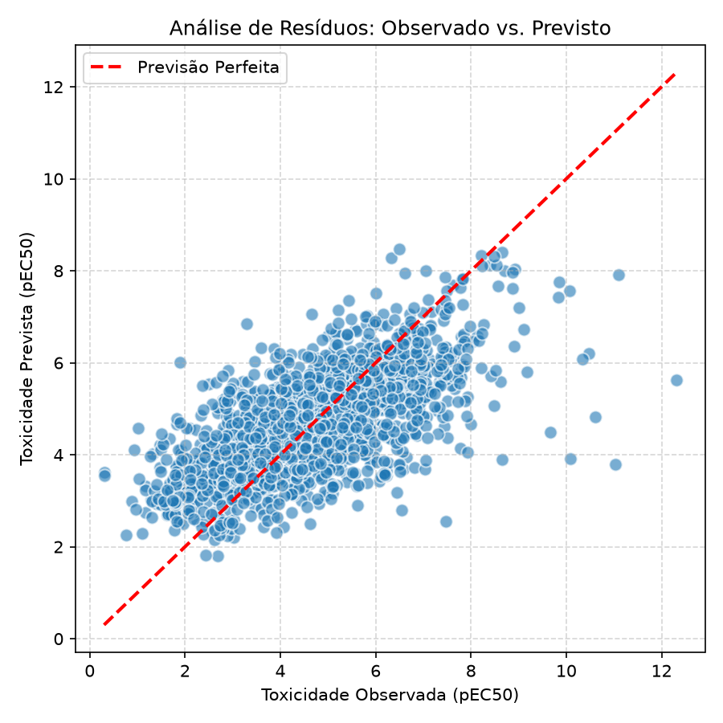
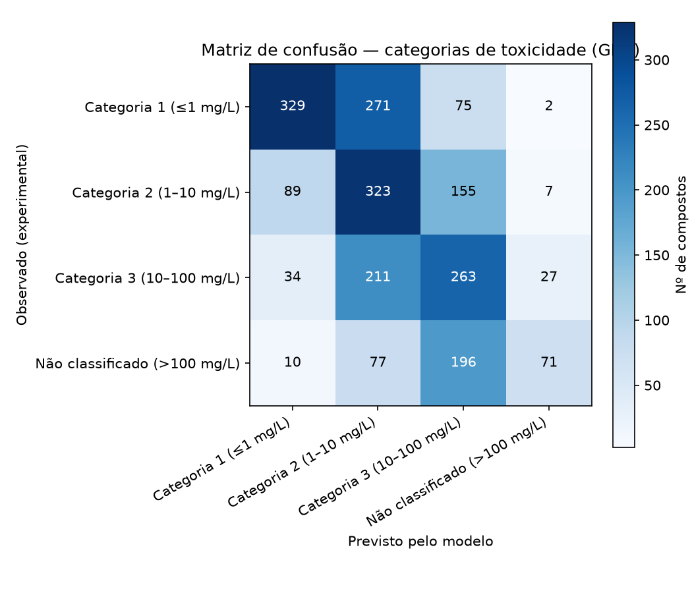

# Relatório de Validação Canônica do Modelo QSAR (Configuração Oficial - TCC)
**Data da Consolidação:** 09/08/2026
**Estratégia de Modelagem:** Combinação de Bases (ECOTOX + EnviroTox) com Controle Taxonômico (One-Hot Encoding para `especie_*`)

Este documento consolida as métricas, os testes estatísticos e as escolhas metodológicas que validam a versão final do modelo preditivo para ecotoxicidade de ativos amazônicos, formatado para compor as seções de Resultados e Metodologia do TCC.

---

## 1. Caracterização do Conjunto de Dados Canônico

Para mitigar a elevada variação inter-laboratorial e a diversidade de sensibilidade entre diferentes algas verdes, a configuração final utilizou uma abordagem de fusão de dados e codificação biológica.

*   **Processamento de Conflitos:** Amostras com o mesmo CAS foram agregadas pela média do pEC50. Compostos com desvio padrão $> 1,0$ na resposta biológica (entre fontes ou laboratórios diferentes) foram descartados, garantindo a qualidade do sinal biológico.
*   **Dimensões da Matriz de Treino:**
    *   **$n$ (Compostos únicos):** 2.140
    *   **$p$ (Descritores totais):** 221
*   **Composição dos Descritores ($p$):** 
    *   174 descritores físico-químicos (RDKit 2D + MACCS Keys)
    *   47 variáveis *one-hot* (`especie_*`), onde cada coluna atua como uma chave booleana (0 ou 1) representando a espécie de alga do bioensaio.
*   **Estatísticas do Target (pEC50):** 
    *   Mínimo: 0,30 | Máximo: 12,31
    *   Média: 4,68 | Desvio Padrão: 1,54

---

## 2. Desempenho Preditivo Global (Validação Cruzada)

O aprendizado e a validação derivam de **um único modelo otimizado** via `GridSearchCV` com 5-*fold cross-validation*.

*   **Algoritmo Vencedor:** Random Forest Regressor
*   **Hiperparâmetros Selecionados:** `n_estimators = 300`, `max_depth = 20`, `min_samples_leaf = 1`
*   **R² (Cross-Validation):** **0,4544**
*   **RMSE (Cross-Validation):** **1,1405** (em logaritmo negativo da concentração molar)

> **Justificativa de Desempenho (TCC):** 
> Na validação primária contendo apenas dados do ECOTOX (sem correção taxonômica), o modelo alcançou $R^2 = 0,4110$. A integração da base EnviroTox acompanhada das 47 colunas `especie_*` elevou a variância explicada para **0,4544** ($\Delta = +0,0434$). Este salto quantitativo comprova, estatisticamente, a hipótese de que a sensibilidade inerente de cada espécie microalgal à toxicidade é um fator de confundimento (ruído) substancial; ao prover essa informação via *one-hot encoding*, o algoritmo se torna capaz de discernir parte dessa variabilidade biológica do sinal toxicológico das estruturas moleculares.

---

## 3. Validação de Robustez (Y-Scrambling)

Para descartar a hipótese de que o modelo estivesse encontrando correlações espúrias (correlações ao acaso dadas as altas dimensionalidades de 221 colunas), executou-se o teste de permutação da variável resposta (Y-Scrambling).

*   **R² real (Média CV):** 0,453
*   **R² embaralhado (Média de 30 ciclos):** -0,123
*   **Diferença entre sinais ($\Delta R^2$):** 0,576
*   **Conclusão:** ✅ **Aprovado**. O $R^2$ após a permutação colapsa para valores negativos, evidenciando que a correlação de 0,4544 origina-se fundamentalmente da relação estrutural (QSAR) verdadeira e não de sobreajuste estatístico (*overfitting*).

---

## 4. Domínio de Aplicabilidade (Método Leverage / h-Matrix)

A predição in silico de novas substâncias requer a garantia de que as moléculas não excedam o espaço químico mapeado durante o treino. O cálculo da alavancagem ($h$) considerou $p = 174$ (pois as flags biológicas `especie_*` não são atributos intrínsecos de uma molécula externa, sendo o limite focado na estrutura físico-química) e $n = 2140$.

*   **Valor de Corte Crítico ($h^*$):** **0,2453** 

Dentre os 17 ativos isolados de extratos amazônicos avaliados, a extensa maioria (13 compostos) atende aos critérios de similaridade. Contudo, **4 ingredientes extrapolaram** o domínio do modelo ($h > h^*$):

1.  **Acemannan (Aloe vera):** $h = 0,8380$
2.  **Óxido de cariofileno:** $h = 0,6764$
3.  **Beta-pineno:** $h = 0,6165$
4.  **Álcool cariofileno:** $h = 0,5613$

> **Nota Metodológica para Redação:** No TCC, deve ficar explícito que os valores preditos (pEC50) para esses 4 ativos não possuem confiabilidade algorítmica assegurada. Eles situam-se em uma zona cega do treinamento e qualquer inferência sobre sua ecotoxicidade via inteligência artificial será, nesta versão do modelo, apenas um exercício de extrapolação hipotética.

---

## 5. Checagem de Plausibilidade Biológica (Importância dos Descritores)

Utilizou-se a métrica Gini Importance (MDI - *Mean Decrease Impurity*) nativa da estrutura de Random Forest para interpretar a contribuição de cada variável nas 300 árvores geradas. A soma de todos os atributos totaliza 1,0 (100%).

| Rank | Descritor | Importância MDI | Tipo / Origem |
| :---: | :--- | :--- | :--- |
| 1 | **MolWt** | 0,2577 (25,7%) | Físico-químico (RDKit) |
| 2 | **LogP** | 0,1858 (18,5%) | Físico-químico (RDKit) |
| 3 | **TPSA** | 0,0354 (3,5%) | Físico-químico (RDKit) |
| 4 | **NumRotatableBonds** | 0,0286 (2,8%) | Físico-químico (RDKit) |
| 5 | **MACCS_3** | 0,0258 (2,5%) | Subestrutura (MACCS) |
| 6 | **MACCS_139** | 0,0228 (2,2%) | Subestrutura (MACCS) |
| ... | ... | ... | ... |
| 10 | **especie_Chlorella_vulgaris** | 0,0106 (1,0%) | Taxonomia (*One-hot*) |
| 11 | **especie_Chlorella_fusca_var...** | 0,0095 (0,9%) | Taxonomia (*One-hot*) |

**Validação de Significância Biológica:** 
As colunas taxonômicas (`especie_*`), somadas, detêm 3,57% do poder preditivo global. O achado mais expressivo é o destaque de *Chlorella vulgaris* aparecendo no **Top 10** geral de descritores. Como o Peso Molecular (MolWt) e o Coeficiente de Partição Octanol-Água (LogP) gerenciam a esmagadora maioria do transporte e permeabilidade de xenobióticos através da membrana celular biológica, o algoritmo captura brilhantemente o dogma central da toxicologia: *tamanho e lipofilicidade determinam a base mecânica da toxicidade*, enquanto a linhagem da alga serve como ajuste paramétrico (ajuste fino).

---

## 6. Riscos Regulatórios: Matriz de Confusão e Taxa de Falso-Seguro

A acurácia global do modelo na conversão para faixas regulatórias do **GHS (Sistema Globalmente Harmonizado)** foi de **46,1%**. Como o erro algorítmico muitas vezes desvia para apenas 1 categoria adjacente, a principal forma de checagem do risco operacional da IA é o controle da taxa de predições **Falso-Seguras**.

*   **Falso-Seguro Estrito:** Ocorre quando a IA indica que um composto pertence à Categoria 3 ou Não Classificado (praticamente atóxico / baixa preocupação), quando na literatura ele pertence comprovadamente à Categoria 1 ($\leq1$ mg/L, toxidade grave).
*   Compostos Reais Categoria 1 no Treino: **677**
*   Quantidade de erros classificados como de baixo risco: **77**
*   **Taxa de Falso-Seguro:** **11,4%** (77 de 677)

> **Limitação Regulamentar (TCC):** 
> Uma taxa de falso-seguro em 11,4% (quase 1 em cada 10) corrobora a utilização do modelo desenvolvido puramente como um mecanismo de **Triagem (*Screening*) Inicial e Priorização**. Ele é capaz de reduzir os custos da fila de avaliações in vitro, mas não substitui o ensaio laboratorial, uma vez que o risco regulatório de chancelar equivocadamente uma substância altamente tóxica é inaceitável em esferas governamentais ou aprovações comerciais finais de cosméticos.

---

## 7. Aplicação Final: Previsão dos 17 Ativos Amazônicos

**Tratamento Metodológico do "Zero-Vector Extrapolation"**
Durante a integração da matriz *one-hot*, toda amostra de treino apresentou obrigatoriamente um valor "1" em alguma coluna `especie_*`. Na aplicação preditiva cega para os 17 ativos amazônicos, deixar todas essas colunas em "0" configuraria um equívoco metodológico, visto que submeteria a rede a um cenário nulo inexistente no mapeamento estatístico inicial do modelo — e esta aberração passaria invisível pelo cálculo de *Leverage*, o qual avalia unicamente as subestruturas químicas.
Como a proposta empírica do laboratório consiste na validação toxicológica frente à linhagem biológica *Chlorella vulgaris*, na predição de todos os compostos, **a variável paramétrica `especie_Chlorella_vulgaris` foi rigorosamente fixada com o valor 1**. Esta correção calibrou os pEC50 para responderem especificamente como essa alga se comportaria frente a esses extratos.

| Ingrediente | pEC50 (Predito) | EC50 mg/L | Classe de Toxicidade GHS | Domínio (h-Matrix) |
| :--- | :--- | :--- | :--- | :--- |
| Alpha-humuleno | 6,42 | 0,08 | Categoria 1 ($\leq1$ mg/L) | ✅ Válido |
| Acemannan (Aloe vera) | 6,07 | 1,46 | Categoria 2 (1–10 mg/L) | ⚠️ Inválido (Extrapolação) |
| Óxido de cariofileno | 5,78 | 0,36 | Categoria 1 ($\leq1$ mg/L) | ⚠️ Inválido (Extrapolação) |
| Álcool cariofileno | 5,32 | 1,07 | Categoria 2 (1–10 mg/L) | ⚠️ Inválido (Extrapolação) |
| Kolavelool | 5,31 | 1,41 | Categoria 2 (1–10 mg/L) | ✅ Válido |
| Alpha-cadinol | 5,28 | 1,16 | Categoria 2 (1–10 mg/L) | ✅ Válido |
| Copalol | 5,27 | 1,56 | Categoria 2 (1–10 mg/L) | ✅ Válido |
| p-Cimeno | 4,13 | 10,01 | Categoria 3 (10–100 mg/L) | ✅ Válido |
| Alpha-felandreno | 3,99 | 13,95 | Categoria 3 (10–100 mg/L) | ✅ Válido |
| Propanodiol | 3,84 | 27,26 | Categoria 3 (10–100 mg/L) | ✅ Válido |
| Sorbitan Caprylate | 3,75 | 52,08 | Categoria 3 (10–100 mg/L) | ✅ Válido |
| Terpinen-4-ol | 3,59 | 39,83 | Categoria 3 (10–100 mg/L) | ✅ Válido |
| Ácido benzóico | 3,58 | 32,19 | Categoria 3 (10–100 mg/L) | ✅ Válido |
| Decyl glucoside | 3,57 | 78,04 | Categoria 3 (10–100 mg/L) | ✅ Válido |
| Beta-pineno | 3,34 | 61,69 | Categoria 3 (10–100 mg/L) | ⚠️ Inválido (Extrapolação) |
| Ácido cítrico | 2,97 | 206,41 | Não classificado ($>100$ mg/L)| ✅ Válido |
| Glicerina (Glycerol) | 1,75 | 1620,05 | Não classificado ($>100$ mg/L)| ✅ Válido |
